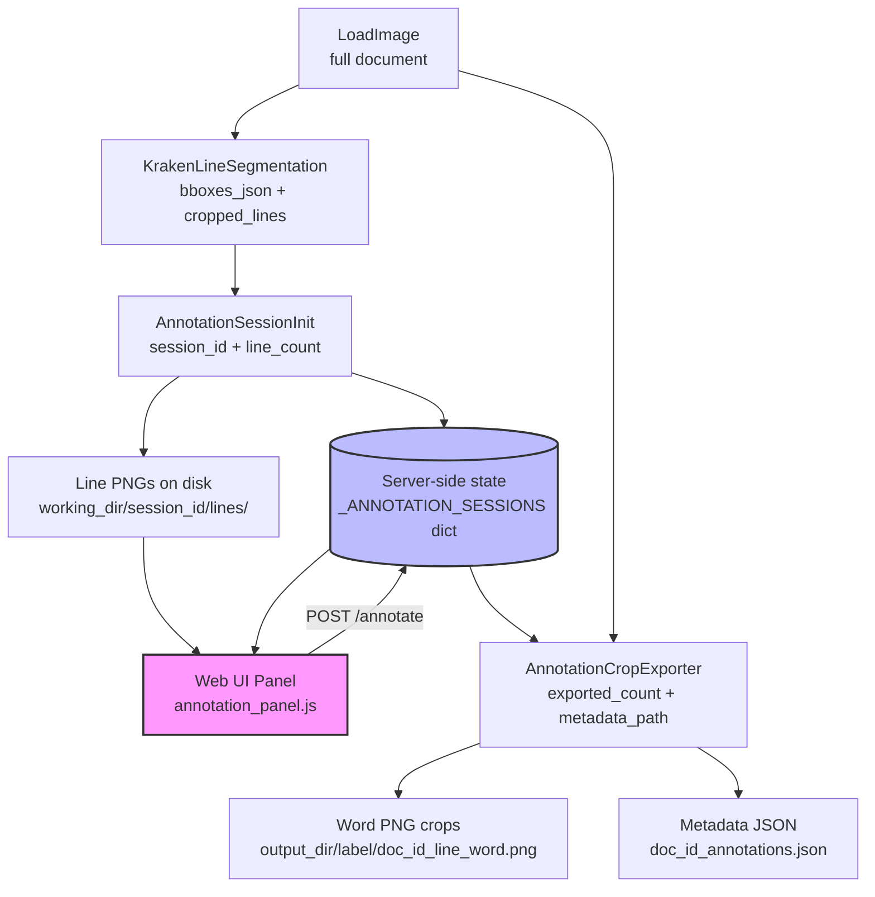
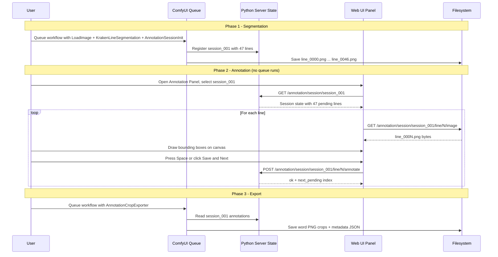

# Sütterlin/Kurrent Word Annotation Tool — Architecture Design

**Project:** `tjk_suetterlin` custom node package  
**Location:** `/mnt/tjkdata/comfyui2/ComfyUI/custom_nodes/tjk_suetterlin`  
**Purpose:** Semi-interactive annotation workflow for building Fraktur vs. Sütterlin classifier training data  
**Date:** 2026-03-10

---

## Table of Contents

1. [Problem Analysis & Constraints](#1-problem-analysis--constraints)
2. [Option Evaluation](#2-option-evaluation)
3. [Recommended Approach: Hybrid B+A](#3-recommended-approach-hybrid-ba)
4. [Node Specifications](#4-node-specifications)
5. [Frontend Component Design](#5-frontend-component-design)
6. [Data Flow Diagram](#6-data-flow-diagram)
7. [Output File Format & Naming Convention](#7-output-file-format--naming-convention)
8. [Implementation Complexity](#8-implementation-complexity)
9. [ComfyUI-Specific Constraints & Gotchas](#9-comfyui-specific-constraints--gotchas)
10. [Integration with Existing Nodes](#10-integration-with-existing-nodes)
11. [File Layout](#11-file-layout)

---

## 1. Problem Analysis & Constraints

### The Core Tension

ComfyUI executes workflows as a **directed acyclic graph (DAG)**. Each node's `FUNCTION` is called once per queue execution and must return synchronously. There is no built-in mechanism to:

- Pause mid-execution and wait for user input
- Loop back to a previous node with new data
- Maintain per-session mutable state across queue runs

This makes true "show line → user draws boxes → advance to next line" interactivity impossible within a single workflow execution.

### What IS Possible in ComfyUI

| Mechanism | What it enables |
|-----------|----------------|
| `OUTPUT_NODE = True` | Node writes side-effects (files) without needing downstream consumers |
| `IS_CHANGED` classmethod | Force re-execution on every queue run (bypass caching) |
| Custom JS frontend extensions | Serve HTML/JS from ComfyUI's web server; communicate via `api.fetchApi()` |
| Custom API routes via `PromptServer` | Register Python HTTP endpoints that JS can call |
| Persistent server-side state | Module-level Python dicts survive between queue runs |
| `RETURN_TYPES = ()` | Node with no outputs — pure side-effect node |

### Key Insight

The annotation loop **cannot** live inside a single queue execution. Instead, it must live in a **persistent server-side state machine** that:
1. Is populated by a ComfyUI node (Phase 1 — segmentation)
2. Is consumed interactively by a custom web UI panel (Phase 2 — annotation)
3. Is read by a second ComfyUI node (Phase 3 — crop export)

This is the **Hybrid B+A** approach described below.

---

## 2. Option Evaluation

### Option A: External Tool Integration

**Pros:**
- Label Studio / CVAT are mature, fast annotation tools
- No custom JS required
- Supports complex annotation types

**Cons:**
- Requires installing and running a separate service (Label Studio server, Docker, etc.)
- Data round-trip: ComfyUI → export folder → Label Studio → import annotations → ComfyUI
- Label Studio's COCO/YOLO export formats need conversion to our naming convention
- Adds significant operational complexity for what is essentially a personal workflow tool
- No tight integration with the existing `KrakenLineSegmentation` output format

**Verdict:** Viable but heavyweight. Overkill for a single-user annotation workflow.

### Option C: ComfyUI Mask Editor

**Pros:**
- Zero new code for the annotation UI
- Works today

**Cons:**
- ComfyUI's mask editor produces a single binary mask, not multiple labeled bounding boxes
- Cannot label multiple disjoint word regions in one pass
- Must re-queue the entire workflow for each line (Kraken re-runs every time)
- No systematic naming or metadata output
- Extremely slow for hundreds of lines

**Verdict:** Unacceptable for the stated requirement of "multiple regions per line" and "fast for hundreds of lines."

### Option B: Built-in Web UI Panel

**Pros:**
- Tight integration — no external services
- Custom UI can be optimized for speed (keyboard shortcuts, auto-advance)
- Annotations stored in server-side Python state — no file round-trips
- Can display line images at full resolution with zoom
- Single ComfyUI instance handles everything

**Cons:**
- Requires writing custom JavaScript (canvas drawing, API calls)
- ComfyUI's frontend extension system is not well-documented
- Must handle browser-server state synchronization carefully

**Verdict:** Best fit for the use case. The JS complexity is manageable (~300 lines of vanilla JS).

### Hybrid B+A (Recommended)

Take Option B's architecture but add a **JSON export/import** escape hatch so annotations can optionally be loaded from an external tool (Label Studio, CVAT) if the user prefers. This gives the best of both worlds:

- Default path: fast built-in web UI
- Fallback path: import annotations from any tool that exports COCO-format JSON

---

## 3. Recommended Approach: Hybrid B+A

### Architecture Overview

The workflow is split into **three phases**, each triggered by a separate ComfyUI queue execution:

```
Phase 1 — Segmentation (one queue run per document)
  LoadImage → KrakenLineSegmentation → AnnotationSessionInit
                                              ↓
                                    Writes line crops to disk
                                    Registers session in server state

Phase 2 — Annotation (interactive, no queue runs)
  User opens ComfyUI → navigates to "Annotation" panel
  Panel shows line images one at a time
  User draws bounding boxes with mouse
  Annotations saved to server-side JSON state via REST API
  (No ComfyUI queue execution needed)

Phase 3 — Export (one queue run per session)
  AnnotationCropExporter → saves word PNG crops + metadata JSON
```

### State Machine

```
Session states: EMPTY → READY → ANNOTATING → COMPLETE → EXPORTED
```

A module-level Python dict `_ANNOTATION_SESSIONS` maps `session_id → SessionState`. This dict persists for the lifetime of the ComfyUI process.

---

## 4. Node Specifications

### Node 1: `AnnotationSessionInit`

**Purpose:** Runs Kraken line segmentation (or accepts pre-segmented lines), saves line crops to a working directory, and registers an annotation session in server-side state.

**Category:** `Sütterlin HTR/Annotation`

**Python class:** `AnnotationSessionInit` in `nodes/annotation_nodes.py`

#### Inputs

| Name | Type | Default | Description |
|------|------|---------|-------------|
| `image` | `IMAGE` | required | Full document image (B×H×W×C tensor) |
| `bboxes_json` | `STRING` | `"[]"` | Line bboxes JSON from `KrakenLineSegmentation`. If empty, node runs its own segmentation. |
| `session_id` | `STRING` | `"session_001"` | Unique identifier for this annotation session. Used in output filenames. |
| `doc_id` | `STRING` | `"doc001"` | Document identifier embedded in output filenames (e.g. `handwritten_doc001_...`). |
| `working_dir` | `STRING` | `"/tmp/annotation_sessions"` | Directory where line crop PNGs are written for the web UI to serve. |
| `line_padding` | `INT` | `8` | Extra pixels added around each line bbox before cropping. |
| `overwrite_existing` | `BOOLEAN` | `False` | If True, overwrites an existing session with the same `session_id`. |

#### Outputs

| Name | Type | Description |
|------|------|-------------|
| `session_id` | `STRING` | Echoes the session_id for wiring to Phase 3 node |
| `line_count` | `INT` | Number of lines registered in the session |
| `session_info` | `STRING` | JSON summary of the session (paths, counts, status) |

#### Behavior

1. Converts input tensor to PIL (first image in batch)
2. Parses `bboxes_json`; if empty, raises a clear error directing user to connect `KrakenLineSegmentation`
3. Creates `working_dir/session_id/lines/` directory
4. Saves each line crop as `line_{idx:04d}.png` (full resolution, no height normalization — unlike `_pil2tensor` which normalizes to 64px)
5. Registers session in `_ANNOTATION_SESSIONS[session_id]`:
   ```python
   {
     "session_id": session_id,
     "doc_id": doc_id,
     "working_dir": working_dir,
     "line_count": N,
     "lines": [
       {
         "line_index": 0,
         "line_png": "/abs/path/to/line_0000.png",
         "source_bbox": [x1, y1, x2, y2],
         "annotations": [],   # filled by web UI
         "status": "pending"  # pending | annotated | skipped
       },
       ...
     ],
     "status": "ready",
     "created_at": "2026-03-10T12:00:00Z"
   }
   ```
6. Returns `OUTPUT_NODE = True` (side-effect node)

#### `IS_CHANGED` behavior

Uses a hash of `(session_id, bboxes_json)` so re-queuing with the same inputs is a no-op unless `overwrite_existing=True`.

---

### Node 2: `AnnotationCropExporter`

**Purpose:** Reads completed annotations from server-side state and saves individual word PNG crops plus a metadata JSON file.

**Category:** `Sütterlin HTR/Annotation`

**Python class:** `AnnotationCropExporter` in `nodes/annotation_nodes.py`

#### Inputs

| Name | Type | Default | Description |
|------|------|---------|-------------|
| `session_id` | `STRING` | required | Session ID from `AnnotationSessionInit` |
| `image` | `IMAGE` | required | Original full document image (same as Phase 1) |
| `output_dir` | `STRING` | `"/mnt/tjkdata/comfyui2/ComfyUI/training_data/suetterlin_words"` | Root directory for exported crops |
| `label` | `STRING` | `"suetterlin"` | Class label embedded in filenames and metadata (e.g. `suetterlin`, `kurrent`) |
| `min_word_width` | `INT` | `10` | Discard crops narrower than this (pixels) |
| `min_word_height` | `INT` | `10` | Discard crops shorter than this (pixels) |
| `export_skipped_lines` | `BOOLEAN` | `False` | If True, also exports auto-segmented words from skipped lines |
| `annotations_json_override` | `STRING` | `""` | Optional: path to a COCO-format JSON file to use instead of server-side state (Option A fallback) |

#### Outputs

| Name | Type | Description |
|------|------|-------------|
| `exported_count` | `INT` | Number of word crops saved |
| `output_dir` | `STRING` | Absolute path to the output directory |
| `metadata_json_path` | `STRING` | Absolute path to the saved metadata JSON file |
| `export_log` | `STRING` | Human-readable summary of what was exported |

#### Behavior

1. Looks up `_ANNOTATION_SESSIONS[session_id]`; raises `RuntimeError` with clear message if not found
2. Checks session status; warns if not all lines are annotated
3. Converts input tensor to PIL (full document image)
4. For each annotated line, for each word bbox in `annotations`:
   - Crops the word region from the full document image (not from the line crop — preserves full resolution)
   - Saves as `{output_dir}/{label}/{doc_id}_line{line_idx:04d}_word{word_idx:03d}.png`
5. Saves metadata JSON to `{output_dir}/{doc_id}_annotations.json`
6. Returns `OUTPUT_NODE = True`

#### `IS_CHANGED` behavior

Always re-executes (returns `float("nan")`), since annotations may have changed since last export.

---

### Node 3: `AnnotationSessionStatus` (utility/display node)

**Purpose:** Displays the current state of an annotation session — how many lines are done, pending, skipped. Useful for monitoring progress without triggering an export.

**Category:** `Sütterlin HTR/Annotation`

**Python class:** `AnnotationSessionStatus` in `nodes/annotation_nodes.py`

#### Inputs

| Name | Type | Default | Description |
|------|------|---------|-------------|
| `session_id` | `STRING` | required | Session to inspect |

#### Outputs

| Name | Type | Description |
|------|------|-------------|
| `status_text` | `STRING` | Human-readable status summary |
| `annotated_count` | `INT` | Lines with at least one annotation |
| `pending_count` | `INT` | Lines not yet visited |
| `skipped_count` | `INT` | Lines explicitly skipped |
| `total_words` | `INT` | Total word bboxes drawn so far |

#### `IS_CHANGED`

Always re-executes (returns `float("nan")`).

---

### Custom API Routes (Python, registered at startup)

These routes are registered in `nodes/annotation_nodes.py` using ComfyUI's `PromptServer` instance. They are called by the frontend JS panel.

```
GET  /annotation/sessions
     → JSON list of all active session IDs and their status

GET  /annotation/session/{session_id}
     → Full session state JSON

GET  /annotation/session/{session_id}/line/{line_index}/image
     → Serves the line PNG as image/png (for display in the web UI canvas)

POST /annotation/session/{session_id}/line/{line_index}/annotate
     Body: {"annotations": [{"x1":10,"y1":5,"x2":80,"y2":45}, ...]}
     → Saves annotations for this line, sets status="annotated"
     → Returns {"ok": true, "next_pending": 3}

POST /annotation/session/{session_id}/line/{line_index}/skip
     → Sets line status="skipped"
     → Returns {"ok": true, "next_pending": 4}

POST /annotation/session/{session_id}/line/{line_index}/clear
     → Clears annotations for this line, resets status="pending"
     → Returns {"ok": true}

GET  /annotation/session/{session_id}/export_json
     → Returns the full annotations as a downloadable JSON file
     → Content-Disposition: attachment; filename="{session_id}_annotations.json"

POST /annotation/session/{session_id}/import_json
     Body: COCO-format or native JSON
     → Imports annotations from external tool (Option A fallback)
     → Returns {"ok": true, "imported_count": N}
```

**Registration pattern** (mirrors how ComfyUI's own nodes register routes):

```python
from server import PromptServer
from aiohttp import web

routes = PromptServer.instance.routes

@routes.get("/annotation/session/{session_id}/line/{line_index}/image")
async def serve_line_image(request):
    session_id = request.match_info["session_id"]
    line_index = int(request.match_info["line_index"])
    # ... serve PNG bytes
    return web.Response(body=png_bytes, content_type="image/png")
```

---

## 5. Frontend Component Design

### File Location

```
custom_nodes/tjk_suetterlin/web/annotation_panel.js
```

ComfyUI automatically serves files from `custom_nodes/*/web/` at `/extensions/{package_name}/`. The JS file registers itself as a ComfyUI extension.

### Extension Registration

```javascript
// web/annotation_panel.js
import { app } from "../../scripts/app.js";

app.registerExtension({
    name: "tjk_suetterlin.AnnotationPanel",
    async setup() {
        // Add "Annotate" button to ComfyUI menu bar
        // Open annotation panel as a floating window
    }
});
```

### Panel Structure (HTML rendered by JS)

```
┌─────────────────────────────────────────────────────────────────┐
│  Sütterlin Word Annotator          [Session: session_001]  [✕]  │
├─────────────────────────────────────────────────────────────────┤
│  Progress: ████████░░░░░░░░  12 / 47 lines  (3 skipped)        │
│  [◀ Prev]  Line 12 of 47  [Next ▶]  [Skip]  [Clear]           │
├─────────────────────────────────────────────────────────────────┤
│                                                                  │
│  ┌──────────────────────────────────────────────────────────┐   │
│  │                                                          │   │
│  │   [Line image displayed on HTML5 canvas]                 │   │
│  │   User drags to draw red bounding boxes                  │   │
│  │   Existing boxes shown with index labels                 │   │
│  │                                                          │   │
│  └──────────────────────────────────────────────────────────┘   │
│                                                                  │
│  Boxes drawn: 3    [Undo last]  [Clear all]  [Save & Next ▶]   │
│                                                                  │
│  Keyboard: Space=Save&Next  S=Skip  U=Undo  C=Clear  ←→=Nav   │
└─────────────────────────────────────────────────────────────────┘
```

### Canvas Interaction Logic

```javascript
class AnnotationCanvas {
    constructor(canvasEl) {
        this.canvas = canvasEl;
        this.ctx = canvasEl.getContext("2d");
        this.boxes = [];          // [{x1,y1,x2,y2}, ...]
        this.drawing = false;
        this.startX = 0;
        this.startY = 0;
        this.imageScale = 1.0;   // for coordinate mapping
        
        // Bind mouse events
        canvasEl.addEventListener("mousedown", this._onMouseDown.bind(this));
        canvasEl.addEventListener("mousemove", this._onMouseMove.bind(this));
        canvasEl.addEventListener("mouseup",   this._onMouseUp.bind(this));
    }
    
    loadImage(sessionId, lineIndex) {
        // Fetch /annotation/session/{id}/line/{idx}/image
        // Draw onto canvas, compute imageScale
    }
    
    _onMouseDown(e) {
        // Start drawing a new box
        this.drawing = true;
        [this.startX, this.startY] = this._canvasToImage(e.offsetX, e.offsetY);
    }
    
    _onMouseMove(e) {
        if (!this.drawing) return;
        // Redraw image + all existing boxes + current rubber-band box
    }
    
    _onMouseUp(e) {
        // Finalize box; discard if too small (< 5px in either dimension)
        this.drawing = false;
        const [ex, ey] = this._canvasToImage(e.offsetX, e.offsetY);
        const box = {
            x1: Math.min(this.startX, ex),
            y1: Math.min(this.startY, ey),
            x2: Math.max(this.startX, ex),
            y2: Math.max(this.startY, ey)
        };
        if ((box.x2 - box.x1) > 5 && (box.y2 - box.y1) > 5) {
            this.boxes.push(box);
        }
        this._redraw();
    }
    
    _canvasToImage(cx, cy) {
        // Map canvas pixel coords → original image pixel coords
        return [Math.round(cx / this.imageScale), Math.round(cy / this.imageScale)];
    }
    
    _redraw() {
        // Clear canvas, draw image, draw all boxes with index labels
    }
    
    undo() { this.boxes.pop(); this._redraw(); }
    clear() { this.boxes = []; this._redraw(); }
    getBoxes() { return [...this.boxes]; }
    setBoxes(boxes) { this.boxes = boxes; this._redraw(); }
}
```

### Session Management JS

```javascript
class AnnotationSession {
    constructor(sessionId) {
        this.sessionId = sessionId;
        this.currentLine = 0;
        this.totalLines = 0;
        this.canvas = null;
    }
    
    async loadSession() {
        const resp = await fetch(`/annotation/session/${this.sessionId}`);
        const data = await resp.json();
        this.totalLines = data.line_count;
        // Find first pending line
        this.currentLine = data.lines.findIndex(l => l.status === "pending") ?? 0;
        await this.loadLine(this.currentLine);
    }
    
    async loadLine(index) {
        this.currentLine = index;
        await this.canvas.loadImage(this.sessionId, index);
        // Load existing annotations if any
        const resp = await fetch(`/annotation/session/${this.sessionId}`);
        const data = await resp.json();
        const lineData = data.lines[index];
        this.canvas.setBoxes(lineData.annotations || []);
        this._updateUI();
    }
    
    async saveAndNext() {
        const boxes = this.canvas.getBoxes();
        await fetch(`/annotation/session/${this.sessionId}/line/${this.currentLine}/annotate`, {
            method: "POST",
            headers: {"Content-Type": "application/json"},
            body: JSON.stringify({annotations: boxes})
        });
        // Advance to next pending line
        const next = await this._findNextPending();
        if (next !== null) await this.loadLine(next);
        else this._showComplete();
    }
    
    async skip() {
        await fetch(`/annotation/session/${this.sessionId}/line/${this.currentLine}/skip`,
                    {method: "POST"});
        const next = await this._findNextPending();
        if (next !== null) await this.loadLine(next);
    }
    
    async _findNextPending() {
        const resp = await fetch(`/annotation/session/${this.sessionId}`);
        const data = await resp.json();
        for (let i = this.currentLine + 1; i < data.lines.length; i++) {
            if (data.lines[i].status === "pending") return i;
        }
        return null;
    }
}
```

### Keyboard Shortcuts

| Key | Action |
|-----|--------|
| `Space` | Save current boxes and advance to next pending line |
| `S` | Skip current line (no annotation) |
| `U` | Undo last drawn box |
| `C` | Clear all boxes on current line |
| `←` / `→` | Navigate to previous / next line (any status) |
| `Z` | Zoom in on canvas |
| `X` | Zoom out on canvas |
| `Escape` | Cancel current rubber-band draw |

### Canvas Scaling Strategy

Line images from `KrakenLineSegmentation` are full-resolution crops (not the 64px-normalized versions used for HTR). A typical line might be 2000×80px. The canvas must:

1. Scale the image to fit the panel width (e.g. 900px wide)
2. Track `imageScale = canvasWidth / imageNaturalWidth`
3. All drawn box coordinates are stored in **original image pixel space** (divided by `imageScale`)
4. When redrawing, multiply stored coords by `imageScale` for display

This ensures the exported crops use the correct coordinates regardless of display zoom.

---

## 6. Data Flow Diagram



### Detailed Phase Flow



---

## 7. Output File Format & Naming Convention

### Word Crop PNG Files

```
{output_dir}/
  {label}/
    {doc_id}_line{line_idx:04d}_word{word_idx:03d}.png
```

**Example:**
```
/mnt/tjkdata/comfyui2/ComfyUI/training_data/suetterlin_words/
  suetterlin/
    doc001_line0003_word000.png
    doc001_line0003_word001.png
    doc001_line0003_word002.png
    doc001_line0007_word000.png
    ...
```

**Rules:**
- `doc_id` comes from the `AnnotationSessionInit` node parameter
- `line_idx` is the 0-based index within the Kraken segmentation output (4 digits, zero-padded)
- `word_idx` is the 0-based index of the drawn box within that line (3 digits, zero-padded)
- Images are saved as **full-resolution RGB PNG** (no height normalization)
- White background for any transparent regions

### Metadata JSON File

```
{output_dir}/{doc_id}_annotations.json
```

**Schema:**
```json
{
  "version": "1.0",
  "session_id": "session_001",
  "doc_id": "doc001",
  "label": "suetterlin",
  "created_at": "2026-03-10T12:00:00Z",
  "exported_at": "2026-03-10T14:30:00Z",
  "source_image": "original_filename_if_known.png",
  "total_words": 87,
  "lines": [
    {
      "line_index": 3,
      "line_bbox": [0, 245, 1800, 310],
      "status": "annotated",
      "words": [
        {
          "word_index": 0,
          "bbox_in_line": [12, 2, 95, 58],
          "bbox_in_document": [12, 247, 95, 308],
          "crop_filename": "doc001_line0003_word000.png",
          "label": "suetterlin"
        },
        {
          "word_index": 1,
          "bbox_in_line": [110, 3, 198, 57],
          "bbox_in_document": [110, 248, 198, 307],
          "crop_filename": "doc001_line0003_word001.png",
          "label": "suetterlin"
        }
      ]
    }
  ]
}
```

**Key design decisions:**
- Both `bbox_in_line` (relative to line crop) and `bbox_in_document` (absolute) are stored — the former is what the user drew, the latter is what the exporter uses for cropping
- `bbox_in_document` is computed as: `[line_x1 + word_x1, line_y1 + word_y1, line_x1 + word_x2, line_y1 + word_y2]`
- The metadata JSON is compatible with the existing `GTPreparationNode` output format (which also saves `.png` files with associated metadata)

### COCO-Format Export (Option A Fallback)

The `GET /annotation/session/{id}/export_json` endpoint can optionally export in COCO format for compatibility with Label Studio / CVAT import:

```json
{
  "images": [
    {"id": 1, "file_name": "doc001_line0003_word000.png", "width": 83, "height": 56}
  ],
  "annotations": [
    {"id": 1, "image_id": 1, "category_id": 1, "bbox": [0, 0, 83, 56], "area": 4648}
  ],
  "categories": [
    {"id": 1, "name": "suetterlin"}
  ]
}
```

---

## 8. Implementation Complexity

### New Files Required

| File | Purpose | Complexity |
|------|---------|------------|
| `nodes/annotation_nodes.py` | 3 node classes + API route registration | Medium-High |
| `web/annotation_panel.js` | Frontend panel with canvas drawing | Medium |

### Changes to Existing Files

| File | Change | Complexity |
|------|--------|------------|
| `nodes/__init__.py` | Add `AnnotationSessionInit`, `AnnotationCropExporter`, `AnnotationSessionStatus` imports | Trivial |

### Breakdown by Component

**`nodes/annotation_nodes.py`** (~400 lines):
- `_ANNOTATION_SESSIONS` dict and session management helpers (~50 lines)
- `AnnotationSessionInit` node class (~100 lines)
- `AnnotationCropExporter` node class (~120 lines)
- `AnnotationSessionStatus` node class (~40 lines)
- `aiohttp` route handlers for the REST API (~90 lines)

**`web/annotation_panel.js`** (~350 lines):
- Extension registration and menu button (~30 lines)
- Panel HTML/CSS generation (~60 lines)
- `AnnotationCanvas` class with mouse events (~120 lines)
- `AnnotationSession` class with API calls (~80 lines)
- Keyboard shortcut handler (~30 lines)
- Session selector dropdown (~30 lines)

### Overall Assessment

This is a **self-contained, moderate-complexity** implementation. The hardest parts are:

1. **Canvas coordinate mapping** — ensuring drawn boxes map correctly back to original image pixels when the canvas is scaled to fit the panel
2. **ComfyUI extension API** — the `app.registerExtension` / `PromptServer.instance.routes` pattern is sparsely documented; existing nodes like `result_viewer_nodes.py` provide the best reference
3. **State persistence across queue runs** — module-level Python dict is simple but lost on ComfyUI restart; a JSON file backup is recommended

The implementation does **not** require:
- Any new Python dependencies (uses `aiohttp` which ComfyUI already depends on)
- Any changes to the Kraken subprocess infrastructure
- Any changes to existing nodes

---

## 9. ComfyUI-Specific Constraints & Gotchas

### 9.1 Node Execution Model

**Constraint:** ComfyUI nodes execute synchronously and must return immediately. There is no `yield`, `await`, or callback mechanism within a node's `FUNCTION`.

**Impact:** The annotation UI cannot be embedded inside a node execution. It must live as a separate HTTP endpoint + JS panel that operates between queue runs.

**Mitigation:** The three-phase architecture (Init → Annotate → Export) cleanly separates the synchronous node executions from the interactive annotation phase.

---

### 9.2 Tensor Batch Handling

**Constraint:** ComfyUI `IMAGE` tensors are always `(B, H, W, C)` float32 in `[0, 1]`. When `B > 1`, all images in the batch must have the same `H` and `W` (they are stacked into a single tensor). The existing `_pil2tensor()` in `kraken_nodes.py` normalizes all images to 64px height and pads width — this is **wrong** for annotation purposes.

**Impact:** `AnnotationSessionInit` must **not** use `_pil2tensor()` for saving line crops. It must save each line crop as an individual PNG at its native resolution.

**Mitigation:** Save crops directly via `pil_img.crop(bbox).save(path)` — bypass the tensor pipeline entirely for the working directory files.

---

### 9.3 `IS_CHANGED` and Caching

**Constraint:** ComfyUI caches node outputs by default. If inputs haven't changed, the node's `FUNCTION` is not called again. This is controlled by the `IS_CHANGED` classmethod.

**Impact for `AnnotationSessionInit`:** Should use a hash of `(session_id, bboxes_json)` to avoid re-running segmentation unnecessarily. Add `overwrite_existing` parameter to force re-run.

**Impact for `AnnotationCropExporter`:** Must always re-execute because annotations change between queue runs. Use:
```python
@classmethod
def IS_CHANGED(cls, **kwargs):
    return float("nan")  # always different → always re-execute
```

**Impact for `AnnotationSessionStatus`:** Same — always re-execute.

---

### 9.4 `OUTPUT_NODE` and the UI Return Value

**Constraint:** Nodes with `OUTPUT_NODE = True` can return a `{"ui": {...}, "result": (...)}` dict instead of a plain tuple. The `ui` dict is sent to the frontend and can display text/images in the node widget.

**Opportunity:** `AnnotationSessionInit` can return:
```python
return {
    "ui": {"text": [f"Session '{session_id}' ready: {line_count} lines"]},
    "result": (session_id, line_count, json.dumps(session_info))
}
```
This shows a status message directly in the node widget without needing a separate `TextOutput` node.

---

### 9.5 Custom Frontend Extension Loading

**Constraint:** ComfyUI loads JS extensions from `custom_nodes/*/web/` directories. The file must use ES module syntax and import from ComfyUI's own module paths.

**Critical path:** The file must be at exactly:
```
custom_nodes/tjk_suetterlin/web/annotation_panel.js
```

ComfyUI serves it at:
```
http://localhost:8188/extensions/tjk_suetterlin/annotation_panel.js
```

The `__init__.py` at the package root (not `nodes/__init__.py`) must expose `WEB_DIRECTORY`:
```python
# __init__.py (package root)
WEB_DIRECTORY = "./web"
```

Without this, ComfyUI will not discover the JS file.

---

### 9.6 `PromptServer` Route Registration Timing

**Constraint:** `PromptServer.instance` is only available after ComfyUI's server has started. Route registration must happen at module import time (when `nodes/annotation_nodes.py` is imported by `nodes/__init__.py`), not inside a node's `__init__` method.

**Pattern:**
```python
# At module level in annotation_nodes.py, after class definitions:
try:
    from server import PromptServer
    from aiohttp import web

    _routes = PromptServer.instance.routes

    @_routes.get("/annotation/session/{session_id}")
    async def _get_session(request):
        ...

except Exception as _e:
    print(f"[AnnotationNodes] Could not register API routes: {_e}")
```

The `try/except` is essential — if ComfyUI is imported in a non-server context (e.g. unit tests), `PromptServer.instance` may not exist.

---

### 9.7 Serving Static Files (Line Images)

**Constraint:** The line PNG crops are saved to an arbitrary filesystem path (the `working_dir` parameter). The web UI needs to fetch them. ComfyUI does not automatically serve arbitrary directories.

**Solution:** Register a dedicated route that reads and serves the PNG bytes:
```python
@_routes.get("/annotation/session/{session_id}/line/{line_index}/image")
async def _serve_line_image(request):
    session_id = request.match_info["session_id"]
    line_index = int(request.match_info["line_index"])
    session = _ANNOTATION_SESSIONS.get(session_id)
    if not session:
        raise web.HTTPNotFound()
    line = session["lines"][line_index]
    png_path = line["line_png"]
    if not os.path.isfile(png_path):
        raise web.HTTPNotFound()
    with open(png_path, "rb") as f:
        data = f.read()
    return web.Response(body=data, content_type="image/png")
```

This avoids any CORS or path-traversal issues.

---

### 9.8 State Loss on ComfyUI Restart

**Constraint:** Module-level Python dicts are lost when ComfyUI restarts. If the user annotates 30 lines, restarts ComfyUI, and then tries to export, the session state is gone.

**Mitigation:** `AnnotationSessionInit` writes the initial session state to a JSON file at `working_dir/session_id/session_state.json`. Each `POST /annotate` call also updates this file. On startup (or when a session is requested that isn't in memory), the server attempts to load from this file:

```python
def _load_session_from_disk(session_id, working_dir):
    state_path = os.path.join(working_dir, session_id, "session_state.json")
    if os.path.isfile(state_path):
        with open(state_path, "r", encoding="utf-8") as f:
            return json.load(f)
    return None
```

This makes the system resilient to restarts without requiring a database.

---

### 9.9 Zero-Batch Tensor Constraint

**Constraint:** ComfyUI cannot handle tensors with batch size 0. If `AnnotationSessionInit` receives an image with no detected lines, it must return a valid (non-empty) tensor for any `IMAGE` outputs.

**Impact:** `AnnotationSessionInit` has no `IMAGE` outputs (it only outputs `STRING` and `INT`), so this constraint does not apply directly. However, `AnnotationCropExporter` must handle the case where zero word crops are exported gracefully — it should log a warning and return `exported_count=0` rather than raising an exception.

---

### 9.10 ComfyUI's `folder_paths` Module

**Opportunity:** Use `folder_paths` to resolve the default `output_dir` for `AnnotationCropExporter`:
```python
try:
    import folder_paths
    _DEFAULT_OUTPUT_DIR = os.path.join(folder_paths.output_directory, "suetterlin_words")
except ImportError:
    _DEFAULT_OUTPUT_DIR = "/tmp/suetterlin_words"
```

This ensures the default output directory is always within ComfyUI's configured output folder, regardless of where ComfyUI is installed.

---

## 10. Integration with Existing Nodes

### Recommended Workflow Connections

**Phase 1 workflow (segmentation):**
```
LoadImage
  └─► KrakenLineSegmentation (device=auto, padding=8)
        ├─► [cropped_lines] → (optional: preview with PreviewImage)
        ├─► [bboxes] ──────► AnnotationSessionInit
        └─► [annotated_image] → (optional: preview)

LoadImage ──────────────────► AnnotationSessionInit
                               (session_id="session_001", doc_id="doc001")
```

**Phase 3 workflow (export):**
```
LoadImage ──────────────────────────────────────────► AnnotationCropExporter
                                                       (session_id="session_001")
PrimitiveNode (STRING "session_001") ───────────────► AnnotationCropExporter

AnnotationCropExporter
  ├─► [exported_count] → TextOutput (display count)
  ├─► [output_dir]     → TextOutput (display path)
  └─► [export_log]     → TextOutput (display summary)
```

### Reuse of Existing Infrastructure

| Existing component | How it's reused |
|-------------------|----------------|
| `KrakenLineSegmentation` | Phase 1: provides `bboxes_json` to `AnnotationSessionInit` |
| `_tensor2pil()` pattern | `AnnotationSessionInit` uses same pattern to convert input tensor |
| `GTPreparationNode` output format | `AnnotationCropExporter` produces compatible `.png` files |
| `folder_paths` usage | Same pattern as `KrakenHTRModelLoader` for default paths |
| `OUTPUT_NODE = True` pattern | Same as `TextOutput` and `GTPreparationNode` |
| `IS_CHANGED` pattern | Same as used in other nodes for cache control |
| `_safe_print()` pattern | Copy into `annotation_nodes.py` for consistent logging |

### What `AnnotationSessionInit` Does NOT Do

- It does **not** run Kraken segmentation itself — it consumes the output of `KrakenLineSegmentation`
- It does **not** normalize line images to 64px height (unlike `_pil2tensor`)
- It does **not** batch line images into a tensor — it saves them as individual files

This clean separation means the existing `KrakenLineSegmentation` node is unchanged and can still be used in HTR workflows independently.

---

## 11. File Layout

### New Files

```
custom_nodes/tjk_suetterlin/
├── nodes/
│   └── annotation_nodes.py          ← NEW: 3 node classes + REST API routes
└── web/
    └── annotation_panel.js          ← NEW: frontend canvas annotation panel
```

### Modified Files

```
custom_nodes/tjk_suetterlin/
├── __init__.py                      ← ADD: WEB_DIRECTORY = "./web"
└── nodes/
    └── __init__.py                  ← ADD: import AnnotationSessionInit,
                                            AnnotationCropExporter,
                                            AnnotationSessionStatus
```

### Runtime Working Directory Structure

```
{working_dir}/
  {session_id}/
    session_state.json               ← Persistent session state (survives restart)
    lines/
      line_0000.png                  ← Full-resolution line crop
      line_0001.png
      ...
      line_0046.png
```

### Export Output Structure

```
{output_dir}/
  {label}/
    {doc_id}_line0000_word000.png    ← Word crop PNG
    {doc_id}_line0000_word001.png
    {doc_id}_line0003_word000.png
    ...
  {doc_id}_annotations.json         ← Full metadata JSON
```

---

## Summary

| Aspect | Decision |
|--------|----------|
| **Approach** | Hybrid B+A: built-in web UI panel + JSON export/import escape hatch |
| **New nodes** | 3: `AnnotationSessionInit`, `AnnotationCropExporter`, `AnnotationSessionStatus` |
| **New REST endpoints** | 7 routes registered via `PromptServer.instance.routes` |
| **New frontend file** | 1: `web/annotation_panel.js` (~350 lines vanilla JS) |
| **New Python file** | 1: `nodes/annotation_nodes.py` (~400 lines) |
| **Modified files** | 2: `__init__.py` (add `WEB_DIRECTORY`), `nodes/__init__.py` (add imports) |
| **External dependencies** | None (uses `aiohttp` already in ComfyUI) |
| **State persistence** | Module-level dict + JSON file backup in `working_dir` |
| **Output format** | Individual PNG crops + metadata JSON with dual bbox coordinates |
| **Naming convention** | `{doc_id}_line{NNNN}_word{NNN}.png` |
| **Annotation speed** | Space bar = save + advance; full keyboard navigation |
| **Restart resilience** | Session state saved to disk after every annotation |