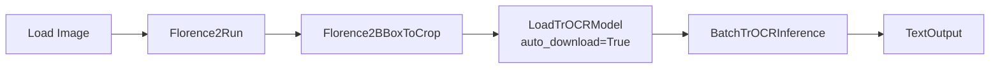
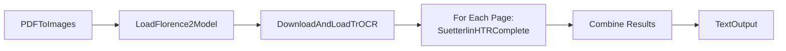
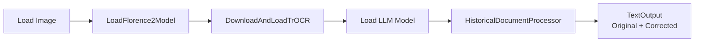

# Final Node Summary - Sütterlin HTR System

## Complete Node List: 14 Nodes

### 📥 Category 1: Input Nodes (2 nodes)
1. **LoadHistoricalDocument** - Load images or PDFs
2. **PDFToImages** - Extract PDF pages as image batch

### 🔍 Category 2: Detection & Segmentation Nodes (2 nodes)
3. **Florence2BBoxToCrop** - Convert Florence-2 bboxes to cropped line images
4. **VisualizeDetections** - Draw bounding boxes on images

### 📝 Category 3: HTR Nodes (6 nodes) ⭐ ENHANCED
5. **DownloadTrOCRModel** - Download models from HuggingFace ✨ NEW
6. **LoadTrOCRModel** - Load models with auto-download ✨ ENHANCED
7. **DownloadAndLoadTrOCR** - One-click download + load ✨ NEW
8. **TrOCRInference** - Transcribe single line
9. **BatchTrOCRInference** - Transcribe multiple lines
10. **TrOCRModelInfo** - Display model information ✨ NEW

### 🎯 Category 4: All-in-One Nodes (2 nodes)
11. **SuetterlinHTRComplete** - Full pipeline (Florence-2 → Crop → TrOCR)
12. **HistoricalDocumentProcessor** - Extended pipeline with LLM support

### 📤 Category 5: Output & Utility Nodes (2 nodes)
13. **TextOutput** - Display and save transcribed text
14. **LLMTextCorrector** - Optional correction/translation

---

## Key Improvements

### ✨ New Features
- **Automatic Model Downloads**: No manual HuggingFace downloads needed
- **One-Click Setup**: `DownloadAndLoadTrOCR` for beginners
- **Progress Tracking**: Visual feedback during downloads
- **Smart Caching**: Download once, use forever
- **Auto-Resume**: Interrupted downloads continue automatically

### 🎯 User Experience Levels

#### Beginner (Easiest)
```
[DownloadAndLoadTrOCR] → [SuetterlinHTRComplete] → [TextOutput]
```
- 3 nodes total
- Automatic everything
- Just select model and go!

#### Intermediate
```
[LoadTrOCRModel (auto_download=True)] → [BatchTrOCRInference] → [TextOutput]
```
- Auto-downloads if needed
- More control over parameters

#### Advanced
```
[DownloadTrOCRModel] → [LoadTrOCRModel] → [TrOCRInference] → [TextOutput]
```
- Explicit control over each step
- Custom paths and settings

---

## Workflow Examples

### Example 1: Quick Start (Beginner)


### Example 2: Modular Workflow (Intermediate)


### Example 3: PDF Batch Processing


### Example 4: Full Pipeline with LLM


---

## Model Download Features

### Supported Models
- `dh-unibe/trocr-kurrent` (19th century, CER ~2.7%, 245 MB)
- `dh-unibe/trocr-kurrent-XVI-XVII` (16th-18th century, CER ~5.4%, 245 MB)

### Download Capabilities
✅ Automatic download from HuggingFace Hub
✅ Progress bars with size/speed info
✅ Resume interrupted downloads
✅ Verify model integrity
✅ Skip if already downloaded
✅ Force re-download option
✅ Custom download locations
✅ Clear error messages

### Status Messages
- `"✓ Model already downloaded (245 MB)"`
- `"⚠ Downloading model... (245 MB, 2.5 MB/s)"`
- `"✓ Downloaded successfully → Loaded to CUDA"`
- `"✗ Network error. Check internet connection."`

---

## Technical Stack

### Core Dependencies
```python
transformers>=4.40.0
torch>=2.0.0
torchvision>=0.15.0
Pillow>=10.0.0
numpy>=1.24.0
huggingface_hub>=0.20.0  # NEW: For model downloads
tqdm>=4.65.0             # NEW: For progress bars
```

### Optional Dependencies
```python
pdf2image>=1.16.0     # PDF support
pypdf>=3.0.0          # PDF metadata
accelerate>=0.20.0    # Model loading optimization
```

---

## Performance Expectations

| Metric | GPU | CPU |
|--------|-----|-----|
| Model download | 1-3 min | 1-3 min |
| First load | 5-10 sec | 10-20 sec |
| Cached load | 2-3 sec | 5-8 sec |
| Single page | 2-5 sec | 10-30 sec |
| 10 pages batch | 15-40 sec | 2-5 min |
| Memory usage | 4-8GB VRAM | 8-16GB RAM |

---

## File Structure

```
tjk_suetterlin/
├── __init__.py
├── nodes/
│   ├── __init__.py
│   ├── input_nodes.py          # LoadHistoricalDocument, PDFToImages
│   ├── detection_nodes.py      # Florence2BBoxToCrop, VisualizeDetections
│   ├── trocr_nodes.py          # All TrOCR nodes (6 nodes)
│   ├── pipeline_nodes.py       # SuetterlinHTRComplete, HistoricalDocumentProcessor
│   ├── output_nodes.py         # TextOutput
│   └── llm_nodes.py            # LLMTextCorrector
├── utils/
│   ├── __init__.py
│   ├── bbox_utils.py           # Bounding box conversion
│   ├── image_utils.py          # Image processing
│   ├── pdf_utils.py            # PDF extraction
│   ├── text_utils.py           # Text formatting
│   ├── model_cache.py          # Model caching
│   └── model_downloader.py     # HuggingFace downloads ✨ NEW
├── examples/
│   ├── basic_workflow.json
│   ├── batch_workflow.json
│   ├── pdf_workflow.json
│   ├── llm_workflow.json
│   └── beginner_workflow.json  # ✨ NEW: One-click setup
├── docs/
│   ├── installation.md
│   ├── quick_start.md          # ✨ NEW: For beginners
│   ├── usage_guide.md
│   ├── model_guide.md
│   └── troubleshooting.md
├── requirements.txt
├── requirements_optional.txt
└── README.md
```

---

## Implementation Phases (Updated)

### Phase 1: Core Infrastructure ⚙️
- Project structure
- Utility functions
- Model caching system
- **Model downloader** ✨ NEW

### Phase 2: Basic Nodes 🔨
- **Download nodes** ✨ NEW
- TrOCR nodes (Load, Inference, Batch)
- Florence2BBoxToCrop

### Phase 3: All-in-One Node 🎯
- SuetterlinHTRComplete
- Integration testing

### Phase 4: Extended Features 📦
- PDF support
- Batch processing
- Visualization

### Phase 5: LLM Integration 🤖
- LLMTextCorrector
- HistoricalDocumentProcessor

### Phase 6: Polish & Docs 📚
- Example workflows (including beginner)
- Documentation
- Testing

---

## Success Criteria

### Functional Requirements
- ✅ Process single images successfully
- ✅ Process PDF documents with multiple pages
- ✅ Batch processing of multiple files
- ✅ Accurate line detection (>90% recall)
- ✅ Readable transcriptions (CER <10% on test set)
- ✅ **Automatic model downloads** ✨ NEW
- ✅ **One-click setup for beginners** ✨ NEW

### User Experience Requirements
- ✅ No manual model downloads needed
- ✅ Clear progress indicators
- ✅ Helpful error messages
- ✅ Multiple workflow complexity levels
- ✅ Comprehensive documentation

---

## Next Steps

1. ✅ **Architecture Complete** - All 14 nodes designed
2. ✅ **Download System Designed** - Auto-download capabilities
3. 📋 **Ready for Implementation** - Switch to Code mode
4. 🚀 **Start with Phase 1** - Core infrastructure + downloader

---

**Total System**: 14 nodes, 3 user experience levels, automatic setup, batch processing, PDF support, LLM integration

**Documentation**: 3 planning documents created
- [`suetterlin_htr_architecture.md`](suetterlin_htr_architecture.md) - Complete architecture (618 lines)
- [`model_download_nodes.md`](model_download_nodes.md) - Download system specification
- [`implementation_summary.md`](implementation_summary.md) - Quick reference
- [`final_node_summary.md`](final_node_summary.md) - This document
