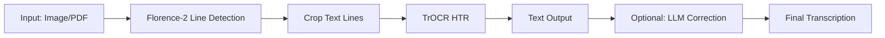

# Sütterlin/Kurrent Historical Document Processing System
## Architecture & Implementation Plan

---

## 1. Project Overview

### Goal
Create a comprehensive ComfyUI custom node package for processing historical German documents (Sütterlin/Kurrent handwriting) with support for:
- Line detection and segmentation using Florence-2
- Handwritten Text Recognition (HTR) using TrOCR models
- Batch processing of images and PDFs
- Optional LLM-based text correction and translation
- Both modular and all-in-one node approaches

### Target Users
Researchers, archivists, and historians working with German historical documents from the 16th-20th centuries.

---

## 2. System Architecture

### High-Level Pipeline



### Node Categories

#### Category 1: Input Nodes
- **LoadHistoricalDocument**: Load images or PDFs
- **PDFToImages**: Extract pages from PDF as image batch

#### Category 2: Detection & Segmentation Nodes
- **Florence2BBoxToCrop**: Convert Florence-2 bounding boxes to cropped images
- **VisualizeDetections**: Draw bounding boxes on original image

#### Category 3: HTR (Handwritten Text Recognition) Nodes
- **LoadTrOCRModel**: Load Sütterlin/Kurrent TrOCR models
- **TrOCRInference**: Process line images to text
- **BatchTrOCRInference**: Process multiple line images

#### Category 4: All-in-One Nodes
- **SuetterlinHTRComplete**: Full pipeline (Florence-2 → Crop → TrOCR)
- **HistoricalDocumentProcessor**: Extended pipeline with LLM support

#### Category 5: Output & Utility Nodes
- **TextOutput**: Display and save transcribed text
- **TextToJSON**: Structure output as JSON
- **LLMTextCorrector**: Optional correction/translation using local LLM

---

## 3. Detailed Node Specifications

### 3.1 LoadHistoricalDocument

**Purpose**: Load image or PDF files for processing

**Inputs**:
- `file_path` (STRING): Path to image or PDF file
- `file_type` (COMBO): ["auto", "image", "pdf"]
- `page_number` (INT): For PDFs, which page to load (default: 1)

**Outputs**:
- `IMAGE`: Loaded image(s)
- `metadata` (JSON): File information

**Features**:
- Auto-detect file type
- Support for JPG, PNG, TIFF, PDF
- Batch loading for multi-page PDFs

---

### 3.2 PDFToImages

**Purpose**: Extract all pages from PDF as image batch

**Inputs**:
- `pdf_path` (STRING): Path to PDF file
- `dpi` (INT): Resolution for extraction (default: 300)
- `start_page` (INT): First page to extract (default: 1)
- `end_page` (INT): Last page to extract (default: -1 for all)

**Outputs**:
- `IMAGES`: Batch of images (one per page)
- `page_count` (INT): Total pages extracted

**Dependencies**: `pdf2image`, `poppler-utils`

---

### 3.3 Florence2BBoxToCrop

**Purpose**: Convert Florence-2 detection results to cropped line images

**Inputs**:
- `image` (IMAGE): Original document image
- `florence2_data` (JSON): Detection results from Florence-2
- `padding` (INT): Pixels to add around each bbox (default: 4)
- `min_width` (INT): Minimum crop width (default: 20)
- `min_height` (INT): Minimum crop height (default: 10)

**Outputs**:
- `cropped_images` (IMAGE): Batch of cropped line images
- `coordinates` (JSON): List of crop coordinates
- `count` (INT): Number of crops

**Logic**:
```python
# Parse Florence-2 quad_boxes format
# Convert to [x1, y1, x2, y2] rectangles
# Apply padding
# Filter by minimum dimensions
# Crop and return batch
```

---

### 3.4 LoadTrOCRModel

**Purpose**: Load TrOCR models optimized for Sütterlin/Kurrent

**Inputs**:
- `model_name` (COMBO): 
  - "dh-unibe/trocr-kurrent" (19th century)
  - "dh-unibe/trocr-kurrent-XVI-XVII" (16th-18th century)
- `device` (COMBO): ["auto", "cuda", "cpu"]
- `dtype` (COMBO): ["auto", "float32", "float16", "bfloat16"]

**Outputs**:
- `TROCR_MODEL`: Model object for inference

**Features**:
- Model caching (load once, reuse)
- Automatic device selection
- Memory-efficient loading

---

### 3.5 TrOCRInference

**Purpose**: Transcribe a single line image

**Inputs**:
- `model` (TROCR_MODEL): Loaded TrOCR model
- `image` (IMAGE): Single line image
- `max_length` (INT): Max tokens to generate (default: 256)

**Outputs**:
- `text` (STRING): Transcribed text
- `confidence` (FLOAT): Model confidence score

---

### 3.6 BatchTrOCRInference

**Purpose**: Transcribe multiple line images in batch

**Inputs**:
- `model` (TROCR_MODEL): Loaded TrOCR model
- `images` (IMAGE): Batch of line images
- `max_length` (INT): Max tokens per line (default: 256)
- `separator` (STRING): Line separator (default: "\n")

**Outputs**:
- `text` (STRING): Combined transcription
- `lines` (LIST[STRING]): Individual line texts
- `confidences` (LIST[FLOAT]): Per-line confidence scores

**Features**:
- GPU batch processing for speed
- Progress tracking
- Error handling for failed lines

---

### 3.7 SuetterlinHTRComplete (All-in-One)

**Purpose**: Complete pipeline from document image to transcription

**Inputs**:
- `image` (IMAGE): Document scan
- `florence2_model` (FL2MODEL): Florence-2 model for detection
- `trocr_model` (TROCR_MODEL): TrOCR model for HTR
- `florence2_task` (COMBO): ["<OCR_WITH_REGION>", "<DENSE_REGION_CAPTION>"]
- `padding` (INT): Bbox padding (default: 4)
- `min_confidence` (FLOAT): Minimum detection confidence (default: 0.3)
- `visualize` (BOOLEAN): Draw detections on image (default: True)

**Outputs**:
- `text` (STRING): Full transcription
- `lines` (LIST[STRING]): Individual line texts
- `annotated_image` (IMAGE): Image with bounding boxes
- `line_images` (IMAGE): Batch of cropped lines
- `metadata` (JSON): Processing statistics

**Pipeline**:
1. Run Florence-2 for line detection
2. Convert bboxes to crops with padding
3. Run TrOCR on each crop
4. Combine results
5. Generate visualization

---

### 3.8 HistoricalDocumentProcessor (Extended All-in-One)

**Purpose**: Full pipeline with optional LLM correction

**Inputs**:
- All inputs from `SuetterlinHTRComplete`
- `llm_model` (LLM_MODEL): Optional LLM for correction
- `llm_prompt` (STRING): Correction instructions
- `enable_llm` (BOOLEAN): Use LLM correction (default: False)

**Outputs**:
- All outputs from `SuetterlinHTRComplete`
- `corrected_text` (STRING): LLM-corrected transcription
- `translation` (STRING): Optional translation

---

### 3.9 TextOutput

**Purpose**: Display and save transcribed text

**Inputs**:
- `text` (STRING): Text to output
- `save_to_file` (BOOLEAN): Save to disk (default: False)
- `output_path` (STRING): File path for saving
- `format` (COMBO): ["txt", "json", "markdown"]

**Outputs**:
- `text` (STRING): Pass-through for chaining
- `file_path` (STRING): Path to saved file

---

### 3.10 VisualizeDetections

**Purpose**: Draw bounding boxes on original image

**Inputs**:
- `image` (IMAGE): Original document
- `bboxes` (JSON): Bounding box coordinates
- `color` (STRING): Box color (default: "red")
- `thickness` (INT): Line thickness (default: 2)
- `show_labels` (BOOLEAN): Show line numbers (default: True)

**Outputs**:
- `annotated_image` (IMAGE): Image with drawn boxes

---

### 3.11 LLMTextCorrector

**Purpose**: Use local LLM to correct OCR errors and translate

**Inputs**:
- `text` (STRING): Raw transcription
- `llm_model` (LLM_MODEL): Local LLM (e.g., Qwen-VL)
- `task` (COMBO): ["correct", "translate", "correct_and_translate"]
- `target_language` (STRING): Translation target (default: "English")
- `custom_prompt` (STRING): Optional custom instructions

**Outputs**:
- `corrected_text` (STRING): Corrected transcription
- `translation` (STRING): Translated text
- `changes` (JSON): List of corrections made

**Supported LLMs**:
- Qwen2.5-VL (via ComfyUI-QwenVL)
- GGUF models (via ComfyUI_VLM_nodes)
- LM Studio integration

---

## 4. Technical Implementation Details

### 4.1 Dependencies

**Core Requirements**:
```python
transformers>=4.40.0
torch>=2.0.0
torchvision>=0.15.0
Pillow>=10.0.0
numpy>=1.24.0
```

**Optional Requirements**:
```python
pdf2image>=1.16.0  # PDF support
pypdf>=3.0.0       # PDF metadata
accelerate>=0.20.0 # Model loading optimization
```

### 4.2 Model Storage

**Directory Structure**:
```
ComfyUI/models/
├── florence2/              # Existing Florence-2 models
├── trocr/                  # New: TrOCR models
│   ├── trocr-kurrent/
│   └── trocr-kurrent-XVI-XVII/
└── LLM/                    # Existing LLM models
```

### 4.3 Florence-2 Integration

**Reuse Existing Infrastructure**:
- Use existing `FL2MODEL` type from ComfyUI-Florence2
- Compatible with existing Florence-2 loader nodes
- Task: `<OCR_WITH_REGION>` for line detection

**Bbox Format**:
```json
{
  "<OCR_WITH_REGION>": {
    "quad_boxes": [[x1,y1, x2,y1, x2,y2, x1,y2], ...],
    "labels": ["text", "text", ...]
  }
}
```

### 4.4 TrOCR Model Loading

**Lazy Loading Pattern**:
```python
class TrOCRModelCache:
    _models = {}
    
    @classmethod
    def load(cls, model_name, device):
        if model_name not in cls._models:
            processor = TrOCRProcessor.from_pretrained(model_name)
            model = VisionEncoderDecoderModel.from_pretrained(model_name)
            model = model.to(device).eval()
            cls._models[model_name] = (processor, model)
        return cls._models[model_name]
```

### 4.5 Batch Processing Strategy

**Image Batching**:
- Process multiple line crops in parallel
- Dynamic batching based on GPU memory
- Fallback to sequential processing if OOM

**PDF Batching**:
- Extract pages sequentially
- Process each page through pipeline
- Aggregate results with page numbers

### 4.6 Error Handling

**Graceful Degradation**:
- Skip invalid crops (too small, corrupted)
- Continue processing on single line failure
- Log errors without stopping pipeline
- Return partial results with error metadata

---

## 5. File Structure

```
tjk_suetterlin/
├── __init__.py                 # Node registration
├── nodes/
│   ├── __init__.py
│   ├── input_nodes.py          # LoadHistoricalDocument, PDFToImages
│   ├── detection_nodes.py      # Florence2BBoxToCrop, VisualizeDetections
│   ├── trocr_nodes.py          # LoadTrOCRModel, TrOCRInference, BatchTrOCRInference
│   ├── pipeline_nodes.py       # SuetterlinHTRComplete, HistoricalDocumentProcessor
│   ├── output_nodes.py         # TextOutput, TextToJSON
│   └── llm_nodes.py            # LLMTextCorrector
├── utils/
│   ├── __init__.py
│   ├── bbox_utils.py           # Bounding box conversion utilities
│   ├── image_utils.py          # Image processing helpers
│   ├── pdf_utils.py            # PDF extraction utilities
│   ├── text_utils.py           # Text formatting and cleaning
│   └── model_cache.py          # Model caching system
├── examples/
│   ├── basic_workflow.json     # Simple Florence2 + TrOCR
│   ├── batch_workflow.json     # Batch processing example
│   ├── pdf_workflow.json       # PDF processing example
│   └── llm_workflow.json       # With LLM correction
├── docs/
│   ├── installation.md
│   ├── usage_guide.md
│   ├── model_guide.md
│   └── troubleshooting.md
├── tests/
│   ├── test_bbox_utils.py
│   ├── test_trocr_inference.py
│   └── test_pipeline.py
├── requirements.txt
├── requirements_optional.txt
└── README.md
```

---

## 6. Example Workflows

### 6.1 Basic Workflow (Modular)

```
[Load Image] 
    → [Florence2Run (OCR_WITH_REGION)]
    → [Florence2BBoxToCrop]
    → [LoadTrOCRModel]
    → [BatchTrOCRInference]
    → [TextOutput]
```

### 6.2 All-in-One Workflow

```
[Load Image]
    → [LoadFlorence2Model]
    → [LoadTrOCRModel]
    → [SuetterlinHTRComplete]
    → [TextOutput]
```

### 6.3 PDF Batch Workflow

```
[PDFToImages]
    → [LoadFlorence2Model]
    → [LoadTrOCRModel]
    → [For Each Page]:
        → [SuetterlinHTRComplete]
    → [Combine Results]
    → [TextOutput (with page numbers)]
```

### 6.4 Extended Workflow with LLM

```
[Load Image]
    → [LoadFlorence2Model]
    → [LoadTrOCRModel]
    → [Load LLM Model]
    → [HistoricalDocumentProcessor]
    → [TextOutput (original + corrected)]
```

---

## 7. Implementation Phases

### Phase 1: Core Infrastructure
1. Set up project structure
2. Implement utility functions (bbox, image processing)
3. Create model caching system
4. Basic error handling framework

### Phase 2: Basic Nodes
1. LoadTrOCRModel
2. TrOCRInference
3. BatchTrOCRInference
4. Florence2BBoxToCrop

### Phase 3: All-in-One Node
1. SuetterlinHTRComplete
2. Integration testing
3. Visualization features

### Phase 4: Extended Features
1. PDF support (LoadHistoricalDocument, PDFToImages)
2. Batch processing optimization
3. VisualizeDetections node

### Phase 5: LLM Integration
1. LLMTextCorrector node
2. HistoricalDocumentProcessor
3. Integration with existing LLM nodes

### Phase 6: Polish & Documentation
1. Example workflows
2. Comprehensive documentation
3. Unit tests
4. Performance optimization

---

## 8. Performance Considerations

### Memory Management
- **Model Caching**: Load models once, reuse across runs
- **Batch Size**: Dynamic based on available VRAM
- **Offloading**: CPU offload for large models if needed

### Speed Optimization
- **GPU Utilization**: Batch inference when possible
- **Parallel Processing**: Multi-threaded PDF extraction
- **Lazy Loading**: Load models only when needed

### Expected Performance
- **Single Page**: 2-5 seconds (GPU) / 10-30 seconds (CPU)
- **Batch (10 pages)**: 15-40 seconds (GPU) / 2-5 minutes (CPU)
- **Memory Usage**: 4-8GB VRAM (with both models loaded)

---

## 9. Testing Strategy

### Unit Tests
- Bbox conversion accuracy
- Image cropping correctness
- Text output formatting

### Integration Tests
- Full pipeline with sample documents
- Batch processing with multiple images
- PDF extraction and processing

### Test Data
- Sample Sütterlin documents (public domain)
- Known transcriptions for accuracy testing
- Edge cases (poor quality, unusual layouts)

---

## 10. Documentation Requirements

### User Documentation
1. **Installation Guide**: Dependencies, model downloads
2. **Quick Start**: Basic workflow examples
3. **Node Reference**: Detailed parameter descriptions
4. **Model Guide**: Which model for which century/script
5. **Troubleshooting**: Common issues and solutions

### Developer Documentation
1. **Architecture Overview**: System design
2. **API Reference**: Function signatures
3. **Extension Guide**: Adding new models/features
4. **Contributing Guidelines**: Code style, PR process

---

## 11. Future Enhancements

### Potential Features
- **Layout Analysis**: Detect paragraphs, margins, headers
- **Multi-Column Support**: Handle complex page layouts
- **Confidence Filtering**: Skip low-confidence detections
- **Interactive Correction**: UI for manual text correction
- **Export Formats**: TEI-XML, ALTO-XML for archival standards
- **Language Detection**: Auto-detect script type
- **Fine-tuning Support**: Train custom TrOCR models

### Model Improvements
- Support for additional TrOCR models
- Integration with Transkribus models
- Custom model training pipeline

---

## 12. Success Criteria

### Functional Requirements
- ✅ Process single images successfully
- ✅ Process PDF documents with multiple pages
- ✅ Batch processing of multiple files
- ✅ Accurate line detection (>90% recall)
- ✅ Readable transcriptions (CER <10% on test set)

### Non-Functional Requirements
- ✅ Processing time <5s per page (GPU)
- ✅ Memory usage <8GB VRAM
- ✅ Clear error messages
- ✅ Comprehensive documentation
- ✅ Example workflows for common use cases

---

## 13. Risk Assessment

### Technical Risks
| Risk | Impact | Mitigation |
|------|--------|------------|
| Florence-2 misses text lines | High | Adjustable confidence threshold, manual bbox input option |
| TrOCR accuracy issues | High | Multiple model options, LLM correction layer |
| Memory constraints | Medium | Dynamic batching, CPU offload option |
| PDF extraction failures | Low | Fallback to image-only mode |

### User Experience Risks
| Risk | Impact | Mitigation |
|------|--------|------------|
| Complex setup | Medium | Clear installation guide, pre-configured workflows |
| Slow processing | Medium | Progress indicators, batch optimization |
| Poor results on edge cases | Low | Documentation of limitations, best practices guide |

---

## 14. Conclusion

This architecture provides a comprehensive, modular, and extensible system for processing historical German documents in ComfyUI. The dual approach (modular + all-in-one nodes) offers flexibility for both simple and complex workflows, while the batch processing and PDF support enable efficient handling of large document collections.

The integration with existing ComfyUI infrastructure (Florence-2, LLM nodes) ensures compatibility and reduces development overhead. The phased implementation approach allows for iterative development and testing, with core functionality delivered early and advanced features added progressively.

**Next Steps**: Review this architecture, provide feedback, and proceed to implementation phase.
